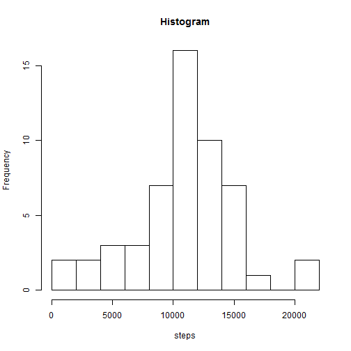
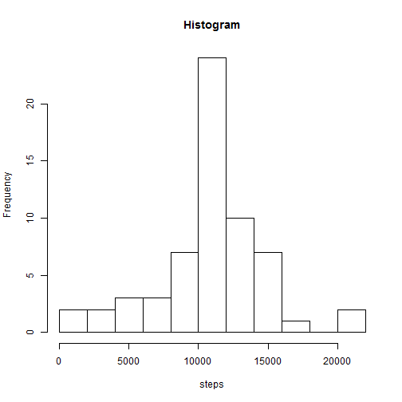
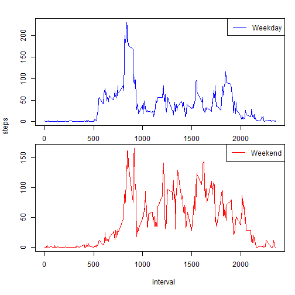

# Course 5 assignment week 2

## Loading and preprocessing the data

Data from a personal activity monitoring device. Includes the steps, the date
and the interval.


```r
library(data.table)
setwd("C:/frodriguezp/DataScience/Rprojects"); 
fname<-"./data/activity.csv"
md0<-read.csv(fname)
md0<-as.data.table(md0)
md0$date<-as.Date(md0$date,"%Y-%m-%d")

md<-md0[!is.na(steps), ]
print(head(md),10)
```

```
##    steps       date interval
## 1:     0 2012-10-02        0
## 2:     0 2012-10-02        5
## 3:     0 2012-10-02       10
## 4:     0 2012-10-02       15
## 5:     0 2012-10-02       20
## 6:     0 2012-10-02       25
```


## Processing
### Mean of total steps taken per day
Total number of steps per day and its histogram

```r
mddate<-md[,.(sum=sum(steps)),by=date]
hist(mddate[,sum],breaks=8
     ,main="Histogram",xlab="steps")
```



Mean and median of the total number of steps taken per day

```r
stats_mddate<-mddate[,.(mean=mean(sum),median=median(sum))]
print(stats_mddate)
```

```
##        mean median
## 1: 10766.19  10765
```

## Average daily activity pattern
Time series plot of the 5-minute interval (x-axis) and the average number of steps taken, averaged across all days (y-axis)

```r
mdint<-md[,.(mean=mean(steps)),by=interval]
with(mdint,plot(interval,mean,type = "l",
                ylab="average number of steps"))
```


```r
intmax<-mdint$interval[which.max(mdint$mean)]
```

The 5-minute interval that contains the maximum number of steps
is the 835 identifier.


## Imputing missing values

Total number of missing values in the dataset

```r
totalna<-sum(is.na(md0$steps))
totaldays<-dim(md0[,.(.N),by=date])[1]
nadays<-totalna/dim(mdint)[1]
print(totalna)
```

```
## [1] 2304
```
The data includes the record form 61 days, but 8 days contain
*NA* values.

Missing values in the dataset will be replaced for the averaged number of steps
for that 5-minute interval


```r
md<-md0
md$steps[is.na(md$steps)]<-rep(mdint$mean,nadays)
```

Histogram of the total number of steps taken each day.

```r
mddate<-md[,.(sum=sum(steps)),by=date]
hist(mddate[,sum],breaks=8
     ,main="Histogram",xlab="steps")
```



```r
stats_mddate<-rbind(stats_mddate,mddate[,.(mean=mean(sum),median=median(sum))])
print(stats_mddate)
```

```
##        mean   median
## 1: 10766.19 10765.00
## 2: 10766.19 10766.19
```
Mainly there is no difference between removing the missing values and replce
them.

## Differences in activity patterns between weekdays and weekends


```r
weekdays<-weekdays.Date(md$date) %in% c("Saturday","Sunday")
weekdays<-factor(weekdays); levels(weekdays)<-c("weekday","weekend")
md$weekdays<-weekdays
mdint<-md[,.(mean=mean(steps)),by=.(interval,weekdays)]

par(mfrow=c(2,1), oma = c(5,4,0,0)+0.1, mar=c(0,0,2,1)+0.1)
with(subset(mdint,weekdays=="weekday"), 
     plot(interval,mean, type = "l", col="blue"))
legend("topright", lty = 1,col = c("blue"), legend = c("Weekday"))

with(subset(mdint,weekdays=="weekend"), 
     plot(interval,mean, type = "l", col="red"))
legend("topright", lty = 1,col = c("red"), legend = c("Weekend"))

title(xlab = "interval",
      ylab = "steps",
      outer = TRUE)
```


  


